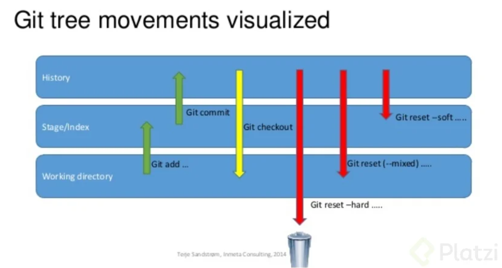
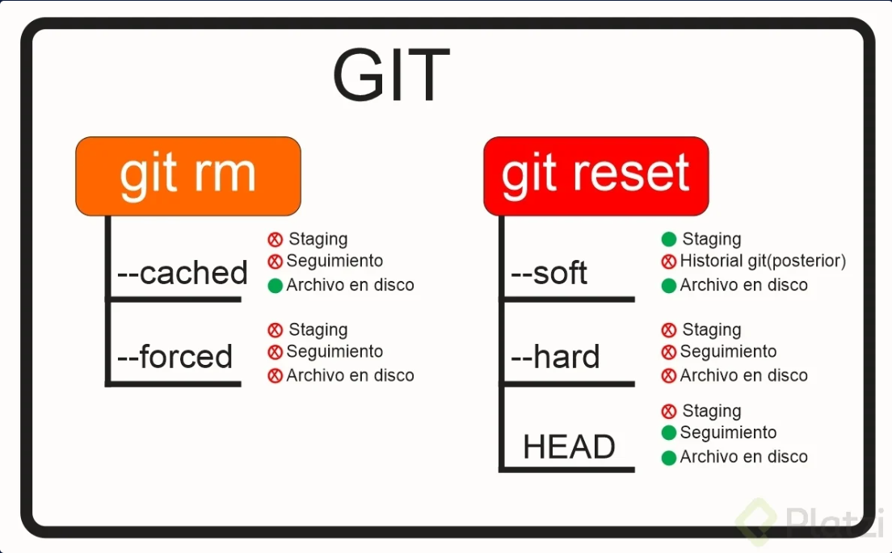

# What is GIT?

I like to say that it is like a super power of a developer or programmer. It is a **version control software**, its purpose is to keep track of changes in computer files (local level) and coordinate the work that several people do on shared files (You can also work alone, no problem). Now if you want to work remotely for that there is GitHub.

Click here to [download Git](https://git-scm.com).

# What is GITHUB?

It is a collaborative development platform or as I like to say it; "The social network of a programmer" that is used to host projects (in the cloud) using the Git version control system. It also has a very useful tool that is GitHub Pages where we can publish our static projects (HTML, CSS and JS or other types of projects) for free.

# Index:

- [Connect to Github](#Connect-to-Github)
- [My first repository](#My-first-repository)
- [We need to clone or make a pull request, what's that?](#We-need-to-clone-or-make-a-pull-request,-what's-that?)
- [How I can name my commits?](#How-I-can-name-my-commits?)
- [Connect a Github repository](#Connect-a-Github-repository)
- [Time travel (Through commits)](#Time-travel-(Through-commits))

# Connect to Github

To display the git version
```
git version
```
Register new user associated with GIT:
>   **WARNING**. Don't put the email of your Github account as a username, it could cause problems in the future.
```
git config --global user.name "my name"
```
It is recommended to use the mail associated with Github
```
git config --global user.email "myemail@example.com"
```
To get help 
```
git help
```

# My first repository. 

Start a new repository and create the hidden .git folder
```
git init
```
See which files have not been registered
```
git status
```
Add all files to watch for changes
```
git add .
```
Or add one file files to watch for changes
```
git add fileName.txt
```
Create commit (current project snapshot)
```
git commit -m "my first commit"
```
Now, if we want to skip the step of adding changes and making a new commit in two separate commands, we can do both steps in one with the following command
```
git commit -am "my first commit"
```
Show the list of commits from newest to oldest
```
git log
```
Show the all the changes line by line in a code or file
```
git show fileName.js
```

In conclusion, we make changes to our files, the status command will verify which files have been modified. When we want to register those changes we will have to add them with add . so you are ready to make a commit. The commit makes the copy of that instant to be able to go back in time if necessary.

# We need to clone or make a pull request, what's that?
When we want to start working on an existing repository in a team, we use git clone. On the other hand, if we want to see the updates that the team has made to the project we are working on, we will create a pull request.

To clone an existing repository in our local computer:
```
git clone url-of-the-repository-in-github
```
To make a pull request and see the new changes in the repository:
```
git pull url-of-the-repository-in-github
```

# How I can name my commits?
The Conventional Commits specification is a lightweight convention on top of commit messages. It provides an easy set of rules for creating an explicit commit history; which makes it easier to write automated tools on top of. This convention dovetails with SemVer, by describing the features, fixes, and breaking changes made in commit messages.

The commit contains the following structural elements, to communicate intent to the consumers of your library:

- **fix:** A commit of the type fix patches a bug in your codebase (this correlates with PATCH in Semantic Versioning).
- **feat:** A commit of the type feat introduces a new feature to the codebase (this correlates with MINOR in Semantic Versioning).
- **build:** Changes related to the build system, external tools, or build configurations.
- **chore:** Maintenance tasks, dependency updates, code refactoring without functional changes, changes to file structure, etc.
- **ci:** Changes to the continuous integration configuration or scripts.
- **docs:** Changes to documentation, such as adding, updating, or removing documentation files.
- **style:** Changes to code style, such as whitespace, indentation, missing semicolons, etc., without underlying logic changes.
- **refactor:** Code changes that don't fix bugs or add new features but improve the code structure, readability, or performance.
- **perf:** Changes related to performance improvements.
- **test:** Adding or modifying tests, both unit and integration tests.

- **BREAKING CHANGE:** a commit that has a footer BREAKING CHANGE:, or appends a **!** after the type/scope, introduces a breaking API change (correlating with MAJOR in Semantic Versioning). A BREAKING CHANGE can be part of commits of any type.

- footers other than BREAKING CHANGE: <description> may be provided and follow a convention similar to git trailer format.

Additional types are not mandated by the Conventional Commits specification, and have no implicit effect in Semantic Versioning (unless they include a BREAKING CHANGE). A scope may be provided to a commit’s type, to provide additional contextual information and is contained within parenthesis, e.g., feat(parser): add ability to parse arrays.


# Connect a Github repository
Did you create a new repository in GitHub and you want to connect it with your local folder?

Remember, fisrt command!
```
git init
```
After doing the "First commit" you will write the next 3 commands:
```
git branch -M main
git remote add origin https://github.com/Your-User-Name/Name-Of-Your-Repository.git
git push -u origin main
```
And that's it, you push your local repository to GitHub!

# <br>Time travel (Through commits)</br>

##### How we can move between the different commits that we have registered, let's suppose we have the following commit with its respective ID:
```
Commit ID: abc12345
```
#### We travel to the specific commit abc12345, this change will keep all the changes we have made without deleting any commit.
```
git reset --soft abc12345
```
#### We travel to the specific commit abc12345 and remove all future changes. **WARNING:** this will delete all changes that have been made without the possibility of recovery.
```
git reset --hard abc12345
```
#### Show all changes even if we delete commits
```
git reflog
```
#### The checkout command will allow us to see how the file originally looked before being modified by the current commits. You can see an example of how it would be used usng de commit ID:
```
git checkout abc12345 fileName.js
```
#### Now, if we want to go back to the current version, the last commit we made, we can use the following command:
```
git checkout master fileName.js
```
#### I'll provide you with a graphical example of how the Git flowchart works:
<br>

<br>

### <br>Modify files</br>

##### We may want to rename, remove or delete a file, it is recommended to do it directly on the command line to register the changes with git.

#### Change file name. 
```
git mv originalName.txt newName.txt
```
#### Delete a file
```
git rm fileName.txt
```
#### Delete a file (in the RAM)
```
git rm --cached fileName.txt
```
#### Variations of Git rm:
- **git rm --cached** will removes files from the local repository and the staging area but keeps them on the hard disk. It stops tracking the change history of these files, so they become untracked.

- **git rm --force** will deletes files from both Git and the hard disk. Git keeps everything, so we can recover deleted files if needed (using advanced commands).

##### Using git rm will completely delete this file from Git!

### What is the difference between git rm and git reset HEAD?
##### The main difference between git rm and git reset HEAD is that git rm removes files from the repository and project history, while git reset takes changes out of the staging area and moves them from the workspace without affecting the repository's history.
<br>

<br>

### <br>Branch</br>

##### So far we have only worked on the "master" branch but we may need to create different branches for git traces.

#### Create a new branch
```
git branch branchName
```
#### It shows us in which branch we are
```
git branch
```
#### We move to the new branch
```
git checkout branchName
```
#### We can merge the master branch with the new one. We move to the new branch
```
git merge branchName
```
#### Delete a branch
```
git branch -d branchName
```


### <br>Tags</br>

##### With the tags we can make versions of our project.

#### Create a tag
```
git tag alphaVersion -m "alpha version"
```

#### List tags
```
git tag
```

#### Delete tags
```
git tag -d tagsName
```

#### Make a version on a previous commit ex: f52f3da
```
git tag -a tagName f52f3da -m "version alpha"
```

#### Show tag information
```
git show tagName
```
